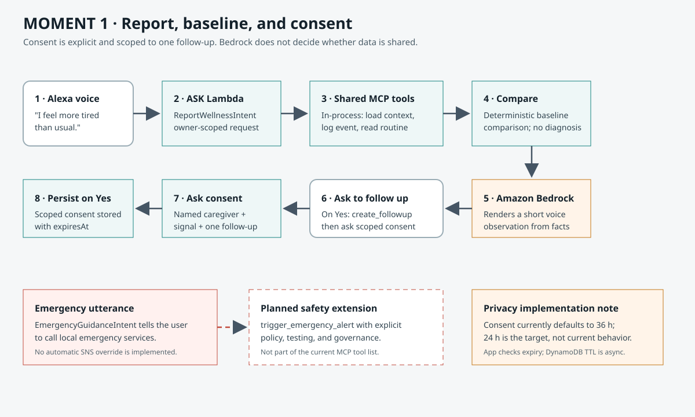
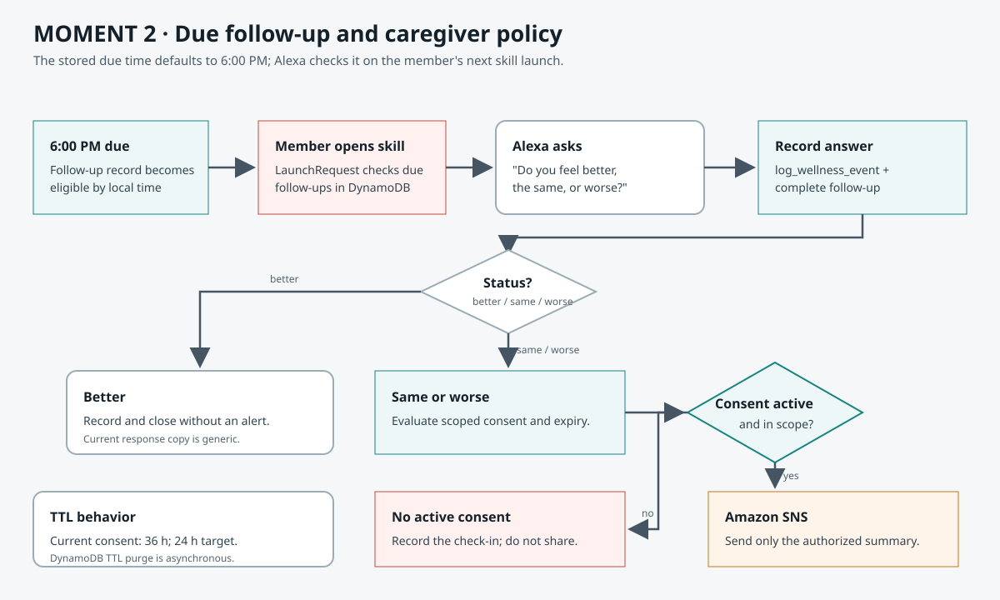
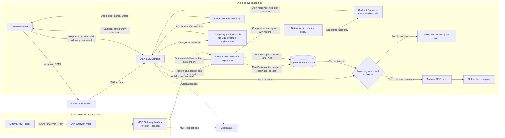

# CarePulse — MCP — AI-Assisted Health Tracking & Proactive Agentic Care

**CarePulse turns voice-reported wellness changes into a consent-gated follow-up workflow, using Alexa, AWS services, and the Model Context Protocol (MCP).**

[](https://aws.amazon.com/bedrock/)
[](https://developer.amazon.com/en-US/alexa/alexa-skills-kit)
[](https://modelcontextprotocol.io/)
[](https://aws.amazon.com/dynamodb/)
[](https://aws.amazon.com/sns/)
[](#technology-and-scope)
[](#team-and-hackathon)

> [!IMPORTANT]
> **Bedrock does not grant consent, authorize disclosure, or trigger a caregiver alert.** The Alexa flow checks consent in application logic before sending. The standalone MCP endpoint currently uses a shared API key and does not independently revalidate the consent record for direct `send_caregiver_alert` calls; treat that key as privileged and do not expose it to untrusted clients.

## Executive Summary

Older adults and people managing ongoing health concerns can experience reporting fatigue. They may also hesitate to involve family caregivers if sharing feels broad, permanent, or outside their control.

**CarePulse MCP** is a voice-first family wellness orchestration skill for Alexa. It records everyday wellness signals, compares recent reports with a member's configured routine, and offers scheduled follow-ups. Before a caregiver can receive a conditional summary, Alexa requests explicit, sequential consent for a named caregiver, a specific signal, and one follow-up. If the member reports feeling the same or worse at that check-in, the application verifies that consent is still active before publishing a minimal, authorized alert through Amazon SNS.

CarePulse is not a medical device, does not diagnose, and is not an emergency service. The current emergency intent directs the user to local emergency services; it does not send an emergency SNS alert.

## Voice Conversation: Judge Demo

The interaction model is `en-US`. This is the representative seeded Elena/Laura conversation contributed by the team. The seed creates two recent tiredness reports and three nights of sleep below Elena's 7.5-hour baseline, so the example observation has supporting demo data. Bedrock may paraphrase that observation; the consent and follow-up turns are driven by the application handlers.

```text
Elena: Alexa, open CarePulse.
Alexa: Welcome to CarePulse. You can tell me how you feel, ask for a wellness
  summary, or schedule a check-in. How can I help?

Elena: I feel more tired than usual.
Alexa: I found similar tiredness reports and sleep below your usual routine. This is a
  change worth following up on, not a diagnosis. Would you like to
  check in again at 6 PM?
Elena: Yes.
Alexa: The check-in is scheduled for 6 PM. Do you authorize Laura to receive a
  brief alert only if you report tiredness again during this follow-up?
Elena: Yes.
Alexa: Done. Your permission applies only to this follow-up, and no other
  information will be shared with Laura.

Later, after the follow-up is due, Elena opens CarePulse again:

Alexa: Elena, we planned to check how you were feeling. Do you feel better,
  the same, or worse?
Elena: I feel the same.
Alexa: Thank you. I recorded the follow-up and sent Laura the brief alert you
  authorized. (SNS configured and publish accepted.)
```

Without an SNS topic configured, the final response instead says the authorized alert was prepared but the notification service is unavailable, and asks the user to contact Laura directly. If the user answers **better**, CarePulse records the follow-up and does not alert the caregiver. If the user declines consent, the follow-up can remain scheduled but no wellness details are shared.

For the emergency-safety demo, say **“I have chest pain”** or **“I cannot breathe.”** The current `EmergencyGuidanceIntent` tells the user to call local emergency services; it does not invoke SNS or bypass consent.

## Engineering Case Study

### Moment 1: Report, Baseline, and Scoped Consent

1. The member reports a wellness signal, such as unusual tiredness or reduced sleep.
2. The Alexa ASK SDK handler derives a pseudonymous owner key, loads the member's care context, records the event, and calls `compare_with_baseline`.
3. The current comparison is deterministic: it looks for repeated signals and sleep below the stored routine. It describes an observed change without diagnosing.
4. When configured, AWS Bedrock rewrites those facts as a short, voice-first observation. Bedrock is not the triage policy engine.
5. Alexa asks whether to create a follow-up. It then asks whether the member authorizes a named caregiver to receive a brief alert only if the same signal is reported at that follow-up. The consent record is written only after an affirmative response.



**Red-flag behavior:** `EmergencyGuidanceIntent` recognizes emergency language such as chest pain or difficulty breathing and tells the user to contact local emergency services. The proposed `trigger_emergency_alert` consent override is **not implemented**; no automatic SNS alert bypasses consent in the current release. See the target tool specification below.

### Moment 2: Scheduled Follow-up and Caregiver Decision

The default follow-up is stored for 6:00 PM in the member's configured time zone. At or after that time, the next Alexa skill launch checks for a due follow-up and asks whether the member feels better, the same, or worse.

- **Better:** the response is recorded, the follow-up is completed, and no caregiver alert is sent. Current voice copy is a neutral acknowledgement; “I'm glad you're feeling better” is a proposed copy improvement, not the exact current response.
- **Same or worse:** the policy checks the completed follow-up and a matching, unexpired, signal-scoped consent. If consent is missing or expired, the event is recorded but not shared. If the policy allows sharing, the application sends a short summary through SNS.



> [!NOTE]
> This prototype does **not** wake Alexa or initiate a check-in at exactly 6:00 PM. It evaluates the due follow-up when the member opens the skill after its due time. A true outbound proactive check-in would require an additional supported scheduling and Alexa Proactive Events design, user permissions, and delivery testing.

## MCP Toolset Specification

The following six names describe the requested target tool contract. The **Current implementation** column is intentional: the deployed MCP `tools/list` surface has eight tools, uses `ownerId` rather than `user_id`, and does not yet expose every target name or behavior.

| MCP tool (target) | Input parameters (target contract) | Purpose and infrastructure backend | Current implementation |
| :--- | :--- | :--- | :--- |
| `get_care_context` | `user_id` | Retrieve care context, routine, caregiver, and relevant history from DynamoDB. | Implemented under this name; input is `ownerId, memberName`. |
| `log_wellness_event` | `user_id, symptom, state, ttl` | Record a wellness event in DynamoDB. | Implemented; input is `ownerId, memberName, signal, state` plus optional details. Event records do not currently receive a TTL. |
| `compare_with_baseline` | `current_event, baseline_data` | Compare recent signals with the member's routine; use structured results for the voice experience. | Implemented with deterministic logic using `ownerId, memberName, signal`; Bedrock only renders voice wording. |
| `store_scoped_consent` | `token, rules, ttl_24h` | Persist explicit, narrow permission with a 24-hour expiration. | Consent behavior is implemented as `request_consent`; current default expiry is **36 hours**, not 24. |
| `trigger_emergency_alert` | `user_id, alert_type` | Proposed red-flag override route to an emergency notification policy and SNS. | **Not exposed or implemented.** Emergency guidance only tells the user to contact emergency services. |
| `send_caregiver_alert` | `user_id, caregiver_id, summary` | Publish a minimum-data notification to the authorized caregiver through SNS. | Alexa calls it after its consent policy allows it. The MCP tool currently trusts caller-provided `authorized` and `consentId`; it does not independently revalidate consent for direct MCP calls. |

### Tools Currently Returned by `tools/list`

The live MCP server currently exposes eight tools: `get_care_context`, `log_wellness_event`, `get_wellness_history`, `compare_with_baseline`, `create_followup`, `request_consent`, `send_caregiver_alert`, and `ingest_bee_context`. `get_wellness_history`, `create_followup`, and `ingest_bee_context` are implementation tools beyond the six-tool target table. The server is a Node.js JSON-RPC Streamable HTTP gateway using MCP protocol version `2025-11-25`; its endpoint requires the `x-carepulse-mcp-key` header and an MCP session.

## Bee Wearable Ingestion (Preview)

> [!NOTE]
> **Preview.** CarePulse can receive Bee-derived context through MCP, gated by the member's voice consent, and show it on the Wellness Snapshot card. CarePulse does **not** call Bee's API yet: a caller must fetch Bee data and translate it into the input format below. Bee's real response fields are still being mapped.

### Flow

```
"Alexa, ask care pulse to link my Bee" ──► consent explained ──► "yes"
        │
        └─► link code shown only in the Alexa app card (stored as a SHA-256 hash, expires in 30 days)

Bee app ──► Bee CLI / API ──► caller maps data ──► MCP tools/call ingest_bee_context { linkCode, beeExport }
        │
        └─► link + consent verified ──► wearer-only text ──► signals (no transcripts) ──► DynamoDB (provenance: bee)

"Alexa, give me my wellness summary" ──► voice summary + Wellness Snapshot card (Bee 🐝 badge on screens)
"Alexa, ask care pulse to unlink my Bee" ──► "yes" ──► consent revoked, link code invalid, Bee signals deleted
```

1. **Consent by voice.** `LinkBeeIntent` explains what is used, what is stored, the 30-day duration (`BEE_CONSENT_DAYS`), and how to stop. Only a "yes" creates the consent and the link code; the code is never spoken aloud.
2. **The link code decides whose data is written.** `ingest_bee_context` takes `linkCode`, not `ownerId`, so an MCP caller cannot write Bee data into an arbitrary member. Linking again invalidates the previous code.
3. **Wearer-only analysis.** Bee also records other people. Only utterances marked `speaker: "wearer"` and facts with `confirmed: true` are analyzed; Bee conversation summaries are ignored because they mix speakers. The response reports what was ignored.
4. **Derived signals only.** Tiredness, sleep, mood, appetite, dizziness, and discomfort are detected with intensity from wording; optional `healthKit.sleepHours` is compared with the member's baseline. No Bee text is stored. Re-sending the same export (same `exportedAt`) is skipped, and Bee events expire after 90 days through `expiresAt`.
5. **Revocation deletes data.** `UnlinkBeeIntent` revokes consent, invalidates the code, and deletes every Bee-derived event while keeping voice reports.

### Input format (CarePulse contract)

```json
{
  "linkCode": "ABCD-2345",
  "beeExport": {
    "exportedAt": "2026-10-09T18:00:00Z",
    "facts": [{ "text": "I felt completely exhausted after lunch", "confirmed": true }],
    "conversations": [{
      "utterances": [
        { "speaker": "wearer", "text": "I am very anxious about the appointment" },
        { "speaker": "other", "text": "This is ignored" }
      ]
    }],
    "healthKit": { "sleepHours": 5 }
  }
}
```

Response: `{ success, eventsIngested, signalsDetected, skipped, ignored: { unconfirmedFacts, otherSpeakerUtterances }, errors }`.

### Mapping real Bee data

Bee developer access requires Developer Mode in the Bee iOS app (tap the app version five times), then `npm install -g @beeai/cli`, `bee login`, and `bee proxy`. To share the shape of real responses without exposing their content:

```
node scripts/bee_schema_report.js facts.json conversations.json
```

The script prints field names and types only, never values.

### Known limitations

- No Bee connector yet; CarePulse holds no Bee credentials. Bee's local proxy is for development only.
- Bee's API does not document sleep or health data; `healthKit.sleepHours` must come from another source.
- Signal detection is English keyword matching and does not handle negation ("not tired").
- The MCP API key is still shared; the link code limits which member a caller can write to, not who may call.

## Privacy Blueprint and Security

### Consent Expiration and DynamoDB TTL

The DynamoDB table enables TTL on the numeric `expiresAt` attribute. Consent checks also compare `expiresAt` with the current time before allowing a disclosure, so an expired record is denied by application policy even if DynamoDB has not physically deleted it yet.

**The requested 24-hour consent TTL is not the current default.** `request_consent` currently sets consent expiry to 36 hours. MCP sessions expire after one hour. DynamoDB TTL deletion is asynchronous: it is not an exact-time deletion guarantee and must not be described as erasing every trace at 24 hours. Voice-reported wellness events and care-context records do not currently have TTL values; Bee-derived events expire after 90 days, and Bee consent after 30 days. The CloudFormation table has `DeletionPolicy: Retain` and point-in-time recovery enabled.

### Minimum Disclosure and Operational Boundaries

- Caregiver alerts contain a brief signal summary and a request to check in; they do not include the member's full wellness history or sleep metrics.
- Consent is scoped to the member, caregiver, signal, and follow-up. A `same` or `worse` response alone is insufficient to authorize sharing.
- Alexa user IDs are hashed into an owner key outside demo mode. `DEMO_OWNER_ID` deliberately overrides that isolation for a repeatable hackathon seed; do not use a shared demo owner for unrelated real users.
- The Alexa tool trace currently logs the pseudonymous owner key and `memberName` to CloudWatch. Review or mask this field before using real identities; do not log symptom details or consent tokens.
- DynamoDB server-side encryption and point-in-time recovery are enabled. SNS uses the AWS-managed SNS KMS key. The HTTP MCP endpoint requires an API key and compares it in constant time.
- The MCP API key is shared across clients and is not bound to an `ownerId`. The Alexa request path checks the consent policy before invoking the alert tool, but a direct MCP caller with the API key can supply `authorized: true` and a non-empty `consentId`; the tool does not currently re-read or validate that consent record. Restrict the key to trusted test operators until authorization is enforced inside the server-side tool.
- SNS acceptance confirms that SNS accepted a publish request; it does not prove that a caregiver received or read the notification.

> [!IMPORTANT]
> Before handling real wellness data, implement the 24-hour consent policy, decide retention/deletion for events and context, reduce identifying log fields, and complete a privacy and threat review. TTL alone is not a complete privacy control.

## Architecture and Repository Layout

```text
.
|-- serverless.yml                         # AWS functions, HTTP API, table, topic, IAM
|-- skill-package/
|   |-- skill.json                         # Alexa skill manifest
|   `-- interactionModels/custom/en-US.json # Voice intents and slot types
|-- lambda/
|   |-- index.js                           # Alexa Lambda entry point
|   |-- alexa_handlers.js                  # ASK request handlers
|   |-- care_service.js                    # Shared wellness and consent rules
|   |-- care_repository.js                 # DynamoDB and local storage adapter
|   |-- mcp_tools.js                       # MCP tool catalog
|   |-- voice_agent.js                     # Bedrock voice rendering
|   |-- voice_copy.js, voice_format.js     # English voice copy and formatting
|   |-- care_dashboard.js, apl/            # Optional ASK screen dashboard
|   |-- mcp_http.js                        # MCP JSON-RPC HTTP gateway
|   |-- sns_notifier.js                    # Caregiver notifications
|   |-- seed_demo.js                       # Hackathon demo data
|   `-- test/                              # Node.js test suite
|-- infrastructure/cfn-deployer/           # CloudFormation deployment assets
|-- docs/                                  # Architecture diagrams
|-- assets/logos/                          # Project marks
`-- ask-resources.json                     # Alexa build/deployment resources
```

Alexa handlers and the MCP HTTP server currently live together under `lambda/`; `alexa_skill/` and `mcp_server/` are conceptual components, not repository directories. The implementation is Node.js/CommonJS. Python and TypeScript are not runtime dependencies; they are not represented as implemented technology by the badge above.

## Runtime orchestration

The deployment has two independent entry points. Alexa invokes its ASK SDK Lambda, which calls the shared MCP tool implementations **in-process**. External MCP clients instead use the HTTP API and MCP gateway Lambda; Alexa does not call that gateway. Both paths use the same DynamoDB table and tool implementation code.



**Important timing detail:** the follow-up is stored with a due time (default 6:00 PM in the member's time zone). No Lambda schedule or Alexa proactive event wakes the user at that time. The next skill launch after the due time prompts for a status. A `better` response closes without an alert; `same` or `worse` proceeds to the Alexa-side consent policy, and SNS is called only if that policy allows sharing.

Bedrock is required in the deployed Alexa runtime (`REQUIRE_BEDROCK=true`) and uses the Converse API to render voice copy from structured comparison facts. It does not decide urgency, consent, or alert delivery. CloudWatch retains logs for 14 days. DynamoDB uses on-demand billing, point-in-time recovery, server-side encryption, TTL on `expiresAt`, and a retain-on-stack-removal policy. Consent currently expires after 36 hours by default; DynamoDB TTL cleanup is asynchronous.

> [!WARNING]
> The standalone MCP gateway currently authenticates with a shared API key but does not bind the caller to an `ownerId` or independently revalidate consent for direct `send_caregiver_alert` calls. The consent decision shown in the Alexa path is enforced by Alexa orchestration. Restrict the MCP key to trusted demo clients until authorization is enforced at the tool boundary.

## Quickstart and Deployment

### Prerequisites

- Node.js 22 or newer and npm.
- AWS CLI v2 authenticated to the target AWS account.
- Serverless Framework 4 (`npx serverless@4` is used below).
- An Alexa custom skill in the Alexa Developer Console and its Skill ID.
- Access to a Bedrock Converse-compatible model in the deployment region.
- An authorized caregiver email or phone number for the SNS subscription test.

Python 3.10+ and the ASK CLI are not required by this repository's current runtime or deployment path. The skill interaction model is uploaded through the Alexa Developer Console.

Verify AWS credentials and install/test the Lambda package:

```sh
aws sts get-caller-identity
npm install --prefix lambda
npm test --prefix lambda
```

The `npm test` command runs the maintained CarePulse conversation and MCP suite. Legacy local files from the earlier vitals prototype are outside the current deployment and test path.

### Environment and Deployment Parameters

| Setting | Source / purpose |
| :--- | :--- |
| `AWS_REGION` | Serverless `--region`; AWS SDK clients use the Lambda region. |
| `CARE_TABLE_NAME` | Set from the `CarePulseTable` CloudFormation resource. The code does not use `DYNAMODB_TABLE_NAME`. |
| `BEDROCK_MODEL_ID` | Required Serverless parameter `bedrockModelId`; model must support Converse in this region. |
| `SNS_TOPIC_ARN` | Set from the `CaregiverAlertsTopic` resource. Subscribe and confirm caregiver endpoints separately. |
| `MCP_API_KEY` | Required deployment parameter for the HTTP MCP gateway; keep it in a secret store or local environment variable. |
| `DEMO_OWNER_ID` | Optional shared demo owner for repeatable seed data; omit for per-Alexa-user hashed owner IDs. |

Deploy from the repository root. Supply the Alexa Skill ID, Bedrock model ID, and a long random MCP key through your shell or deployment secret manager; do not commit the key.

```sh
npx serverless@4 deploy \
  --stage dev \
  --region us-east-1 \
  --param="alexaSkillId=amzn1.ask.skill.REPLACE_ME" \
  --param="mcpApiKey=$CAREPULSE_MCP_KEY" \
  --param="bedrockModelId=YOUR_BEDROCK_MODEL_ID" \
  --param="demoOwnerId=hackathon-demo"
```

After deployment:

1. Read the CloudFormation outputs `AlexaLambdaArn`, `McpEndpoint`, `CarePulseTableName`, and `CaregiverAlertsTopicArn`.
2. In Alexa Developer Console, open your custom skill and confirm its Skill ID matches the `alexaSkillId` deployment parameter.
3. Under **Build → Interaction Model → JSON Editor**, paste the contents of `skill-package/interactionModels/custom/en-US.json`, save, and build the model. Confirm the locale is **English (US)** and the invocation name is **care pulse**. Enable the `Alexa.Presentation.APL` interface to test the optional dashboard on supported devices.
4. Under **Build → Endpoint**, select **AWS Lambda ARN** for the skill's endpoint region and paste `AlexaLambdaArn`. Save the endpoint.
5. Open **Test**, switch the test stage to **Development**, and enable testing for the development version of the skill. Use the Alexa simulator input to send the utterances below; the test tab invokes the deployed Lambda, so AWS credentials, Bedrock model access, and the deployed resources must already be valid.
6. Subscribe the authorized test caregiver to `CaregiverAlertsTopicArn`. Confirm the email subscription before running the notification scene.
7. Keep the returned MCP session ID and send it on later requests. Every MCP request must include the `x-carepulse-mcp-key` header.

### Smoke Test in Alexa Developer Console

This is the actual ASK SDK conversation flow, split into setup and a later check-in. In **Test → Development**, enter phrases without the wake word. Use seeded demo data and start before 6:00 PM in the configured time zone so the follow-up is due that day.

| Console input | What the handler does | Expected next response |
| :--- | :--- | :--- |
| `open CarePulse` | Starts the custom Alexa Skill. | Welcome prompt. |
| `I feel more tired than usual` | `ReportWellnessIntent` records the signal and compares it with recent reports and routine. | Bedrock-rendered observation, then asks whether to check in at 6 PM unless suggestions are off. |
| `Yes` | Confirms the follow-up and creates it for 6:00 PM. | Confirms the schedule, then asks whether Laura may receive a narrowly scoped alert. |
| `Yes` | `AMAZON.YesIntent` stores consent for that signal and follow-up only. | Confirms the scope of permission. |

The two `Yes` answers have different meanings: the first creates the follow-up; the second grants permission to share a matching future check-in. After the due time, open a **new skill session**:

| Console input | What the handler does | Expected next response |
| :--- | :--- | :--- |
| `open CarePulse` | `LaunchRequestHandler` finds the due follow-up. | Asks whether Elena feels better, the same, or worse. |
| `I feel the same` | `CompleteFollowupIntent` records the answer and evaluates the scoped consent. | Sends the brief alert if SNS accepted the publish; without SNS delivery, asks the user to contact Laura directly. |

The simulator does not advance Lambda's clock. For the normal demo, start before 6:00 PM and return after it. For an accelerated integration test, a trusted test operator can create a test-only follow-up due a few minutes ahead with the authenticated MCP `create_followup` tool, wait until it is due, and reopen the Skill. Do not use production member data.

To verify the no-alert branch, repeat with a test identity, decline the second permission question, and complete the due check-in; or answer `I feel better` after a consented check-in. Try `Give me my wellness summary` to test `GetWellnessSummaryIntent`.

### Voice and screen preferences

The ASK skill supports English (US) preference commands: `use short summaries`, `use detailed summaries`, `set my follow up time to eight PM`, and `turn off follow up suggestions` (`turn on follow up suggestions` restores them). Summary length changes spoken detail; the card still contains the full summary. The preferred time applies to newly created follow-ups when the user does not specify a time. Turning suggestions off leaves reporting and explicit follow-up requests available. The current MVP stores these preferences in the member context.

On an APL-capable device, an explicit summary request includes a simple dashboard with the latest report from the last 30 days, the next stored follow-up, and the active permission for the default caregiver on that follow-up. The summary remains fully usable by voice without APL. The interface is declared in `skill-package/skill.json`; enable it in the Developer Console as well if updating the skill there manually. This dashboard is part of the ASK experience, not a registered Alexa+ MCP App UI. See [Amazon's ASK APL integration guide](https://developer.amazon.com/en-US/docs/alexa/alexa-presentation-language/use-apl-with-ask-sdk.html).

If the Skill does not respond as expected, verify that the interaction model built successfully, the `AlexaLambdaArn` and region are correct under **Build → Endpoint**, and the stage is **Development**. Then inspect the `alexaSkill` Lambda logs in CloudWatch. The deployed voice flow requires `BEDROCK_MODEL_ID` and access to that model in the selected region.

Initialize the MCP protocol session (replace the endpoint and key with deployment values):

```sh
curl -i "$CAREPULSE_MCP_ENDPOINT" \
  -H 'content-type: application/json' \
  -H 'accept: application/json, text/event-stream' \
  -H "x-carepulse-mcp-key: $CAREPULSE_MCP_KEY" \
  --data '{"jsonrpc":"2.0","id":1,"method":"initialize","params":{"protocolVersion":"2025-11-25","capabilities":{},"clientInfo":{"name":"carepulse-demo","version":"1.0.0"}}}'
```

The response includes `Mcp-Session-Id`. Pass that header on `tools/list` and `tools/call` requests. The MCP gateway and Alexa skill share the same DynamoDB-backed tools.

### Seed Demo Data

The seed script creates recent tiredness and sleep reports, Elena's routine, and Laura as caregiver. It does **not** create consent; the member must grant it in the voice interaction.

```sh
cd lambda
CARE_TABLE_NAME="YOUR_CAREPULSE_TABLE_NAME" \
DEMO_OWNER_ID="hackathon-demo" \
AWS_REGION="us-east-1" \
npm run seed:demo
```

> [!NOTE]
> A live proactive 6:00 PM voice prompt and the emergency SNS override are future work. The current judge demo simulates the later interaction by reopening the skill after the stored due time.

## Tests and Operations

Run the suite:

```sh
npm test --prefix lambda
```

Tail the Alexa Lambda logs:

```sh
npx serverless@4 logs --function alexaSkill --stage dev --region us-east-1 --tail
```

Package without deploying:

```sh
npx serverless@4 package \
  --stage dev \
  --region us-east-1 \
  --param="alexaSkillId=amzn1.ask.skill.REPLACE_ME" \
  --param="mcpApiKey=$CAREPULSE_MCP_KEY" \
  --param="bedrockModelId=YOUR_BEDROCK_MODEL_ID"
```

To remove the compute stack after the event, use `npx serverless@4 remove` with the same stage, region, Skill ID, MCP key, and Bedrock model parameters used during deployment. The DynamoDB table is retained; review and delete it separately only when retention requirements permit.

## Technology and Scope

- **Implemented:** Alexa ASK SDK v2, Node.js 22, AWS SDK for JavaScript v3, Amazon Bedrock Converse, Amazon DynamoDB, AWS SNS, MCP Streamable HTTP.
- **Not implemented in this repository:** Python services, TypeScript services, a separate `alexa_skill/` or `mcp_server/` package, 24-hour consent expiry, an SNS emergency override, or an autonomous scheduled Alexa push.
- **Current consent expiry:** 36 hours by default. Change the implementation and tests before claiming a 24-hour policy in a release.
- **Current alert rule:** only a `same` or `worse` follow-up with matching active scoped consent can reach `send_caregiver_alert`.

## Team and Hackathon

Built by **Vicente, Ethel and Emmanuel** for **Build, Ship, Shape: Amazon Developer Hackathon**. CarePulse MCP is a hackathon candidate project; this README does not claim an award or production medical certification.
