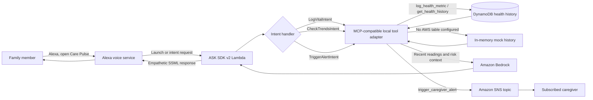

# CarePulse MCP

CarePulse is a voice-first family health assistant for Alexa. It records family vital signs, summarizes recent patterns, and can notify caregivers when a reading needs attention. Health guidance is informational and does not replace a clinician or emergency services.

## Voice flows

- Log blood pressure, temperature, heart rate, and sleep for a named family member.
- Ask for a family member's trends today, this week, or this month.
- Request a caregiver alert by voice.

Examples: “log temperature for Lia as 38 point 8,” “record blood pressure for Dad 120 over 80,” “how has Lia been doing this week,” and “alert my caregiver for Dad.”

## Demo conversation

The current interaction model is `en-US`, so the phrases below are spoken in English. Start with:

```text
User: Alexa, open Care Pulse.
Alexa: Welcome to Care Pulse. I can help you log a family member's vital signs,
	   check health trends, or contact a caregiver. What would you like to do?
User: Log temperature for Lia as 38 point 8.
Alexa: I have recorded Lia's temperature as 38.8 degrees Celsius. This reading
	   may need attention, but I could not send the caregiver alert. Please
	   contact them directly.
User: How has Lia been doing this week?
Alexa: [A short trend summary based on Lia's recent readings.]
```

The alert response above is the expected local-demo behavior without an SNS topic. In an AWS deployment, Alexa says the alert was sent only after SNS accepts the publish request; that does not confirm the caregiver received or read it. To demonstrate a normal reading, use a temperature below 38.5 degrees Celsius or log heart rate, sleep, or blood pressure. An explicit alert can be requested with “Alexa, ask Care Pulse to send a caregiver alert for Lia.”

## Architecture and voice flow



For a high temperature, the Lambda evaluates the current reading and recent history with Bedrock when configured. The deterministic threshold above 38.5 degrees Celsius remains as a fallback. SNS delivery requires a deployed topic and a caregiver subscription; local mock mode never reports an alert as delivered.

## Backend

The ASK SDK v2 Lambda uses AWS SDK v3 and requires Node.js 20 or later. The CloudFormation stack defaults to Lambda `nodejs22.x` because AWS has deprecated its Node.js 18 and 20 Lambda runtimes. `lambda/mcp_client.js` exposes MCP-compatible tool definitions and dispatch for health logging, history, trend analysis, and caregiver alerts. With `HEALTH_TABLE_NAME`, readings are stored in DynamoDB. Without AWS configuration, readings use an in-memory mock for local simulations. The mock is not durable across Lambda cold starts.

Bedrock summaries and risk assessment are enabled when `BEDROCK_MODEL_ID` is configured and the Lambda role can invoke that model in the deployed region. A deterministic temperature threshold (> 38.5 degrees Celsius) remains active when Bedrock is unavailable. Configure `SNS_TOPIC_ARN` and subscribe caregiver email or SMS endpoints to the SNS topic before relying on delivery. Mock mode never claims an alert was delivered.

## Local checks

From `lambda/`, install the package and run its tests:

```sh
npm install
npm test
```

The CloudFormation stack creates a DynamoDB table and an SNS topic, and accepts `BedrockModelId` as a parameter. Subscribe the intended caregiver endpoints to the stack's `CaregiverAlertsTopicArn` output. Use only appropriately authorized health data and configure access, retention, and consent for the deployment environment.
