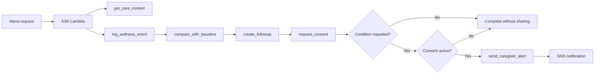

# CarePulse MVP

CarePulse is a voice-first family wellness orchestration skill for Alexa. It records everyday wellness signals, compares them with a member's configured routine, schedules a follow-up, requests scoped consent, and notifies an authorized caregiver only when the configured condition is repeated.

CarePulse does not diagnose, classify a medical condition, or replace professional or emergency care.

## MVP conversation

```text
Elena: Alexa, open Care Pulse.
Elena: I feel more tired than usual.
Alexa: I found similar reports and sleep below your usual routine. This is a
       change worth following up on, not a diagnosis. Would you like me to
       check in again at six?
Elena: Yes.
Alexa: Do you authorize Laura to receive a brief alert only if you report
       tiredness again during that check-in?
Elena: Yes.

Later:

Alexa: Elena, we planned to check how you were feeling. Do you feel better,
       the same, or worse?
Elena: I feel the same.
Alexa: I recorded the follow-up and sent Laura the brief alert you authorized.
```

## Alexa intents

| Intent | Purpose | Important slots |
| --- | --- | --- |
| `ReportWellnessIntent` | Record tiredness, sleep, mood, appetite, dizziness, or discomfort. | `memberName`, `wellnessSignal`, `intensity`, `sleepHours` |
| `ScheduleFollowupIntent` | Create a wellness check-in, defaulting to 6:00 PM. | `memberName`, `wellnessSignal`, `followupTime` |
| `ConfigureCaregiverAlertIntent` | Start the explicit consent step for a conditional caregiver alert. | `memberName`, `caregiverName`, `wellnessSignal` |
| `CompleteFollowupIntent` | Record whether the member feels better, the same, or worse. | `memberName`, `followupStatus` |
| `GetWellnessSummaryIntent` | Return a short voice summary and Alexa card. | `memberName`, `timeframe` |
| `EmergencyGuidanceIntent` | Direct immediate-danger language to local emergency services. | None |
| `AMAZON.YesIntent` / `AMAZON.NoIntent` | Confirm or decline follow-up and scoped consent. | None |

The interaction model is in `skill-package/interactionModels/custom/en-US.json`.

## Runtime orchestration



The alert decision is deterministic: the follow-up result must be `same` or `worse`, and an unexpired consent record must match the member, caregiver, signal, and follow-up ID. Bedrock is a required runtime dependency and turns the structured comparison into the short, voice-first response used by the main demo flow. It cannot authorize sharing or trigger an alert.

Every tool call writes a compact `mcp_tool_completed` trace to CloudWatch so the orchestration can be shown in the hackathon video.

## AWS resources

`serverless.yml` creates:

- One Node.js 22 Lambda function for the Alexa custom skill.
- One Node.js 22 Lambda function and HTTP API route for the MCP `2025-11-25` JSON transport.
- One encrypted DynamoDB single table for context, wellness events, follow-ups, and consent records.
- One encrypted SNS topic for authorized caregiver notifications.
- Least-privilege Lambda permissions for DynamoDB, SNS, CloudWatch, and required Bedrock invocation.
- An Alexa Skills Kit invocation permission restricted to the supplied Skill ID.
- Fourteen-day CloudWatch log retention.

DynamoDB point-in-time recovery is enabled. The table uses `DeletionPolicy: Retain`, so removing the Serverless stack does not delete the wellness records automatically.

## Prerequisites

- Node.js 22 or newer.
- AWS CLI v2 authenticated to the deployment account.
- Serverless Framework 4.
- An Alexa custom skill created in the Alexa Developer Console, with its Skill ID available.
- Bedrock model access enabled in the selected deployment region.

Verify the AWS identity before deploying:

```sh
aws sts get-caller-identity
```

Install dependencies and run the local tests:

```sh
npm install --prefix lambda
npm test --prefix lambda
```

## Deploy with Serverless

Replace the example Skill ID with the ID from the Alexa Developer Console:

```sh
npx serverless@latest deploy \
  --stage dev \
  --region us-east-1 \
  --param="alexaSkillId=amzn1.ask.skill.REPLACE_ME" \
  --param="mcpApiKey=REPLACE_WITH_A_LONG_RANDOM_VALUE" \
  --param="bedrockModelId=YOUR_BEDROCK_MODEL_ID" \
  --param="demoOwnerId=hackathon-demo"
```

`demoOwnerId` makes the recorded demo reproducible across simulator sessions. Omit it outside the hackathon demo so CarePulse derives a pseudonymous owner key from the Alexa user ID. `bedrockModelId` is required; Serverless will reject the configuration if it is missing. The selected model must support the Bedrock Converse API and be available in the deployment region.

Inspect the deployed outputs:

```sh
aws cloudformation describe-stacks \
  --stack-name carepulse-mvp-dev \
  --query 'Stacks[0].Outputs[*].[OutputKey,OutputValue]' \
  --output table
```

Copy `AlexaLambdaArn` into **Alexa Developer Console → Endpoint → AWS Lambda ARN**. Then open the JSON editor under **Interaction Model**, paste `skill-package/interactionModels/custom/en-US.json`, save, and build the model.

`McpEndpoint` is the JSON Streamable HTTP endpoint. All MCP requests must include the `x-carepulse-mcp-key` header. For the hackathon, keep this key in a local environment variable or secret store and never commit it.

Initialize an MCP session:

```sh
CAREPULSE_MCP_ENDPOINT=$(aws cloudformation describe-stacks \
  --stack-name carepulse-mvp-dev \
  --query "Stacks[0].Outputs[?OutputKey=='McpEndpoint'].OutputValue" \
  --output text)

CAREPULSE_MCP_KEY='THE_SAME_VALUE_USED_DURING_DEPLOYMENT'

curl -i "$CAREPULSE_MCP_ENDPOINT" \
  -H 'content-type: application/json' \
  -H 'accept: application/json, text/event-stream' \
  -H "x-carepulse-mcp-key: $CAREPULSE_MCP_KEY" \
  --data '{"jsonrpc":"2.0","id":1,"method":"initialize","params":{"protocolVersion":"2025-11-25","capabilities":{},"clientInfo":{"name":"carepulse-demo","version":"1.0.0"}}}'
```

Keep the returned `Mcp-Session-Id` header and send it on subsequent `tools/list` and `tools/call` requests. The MCP gateway and Alexa use the same tool definitions and DynamoDB records.

## Subscribe the demo caregiver

Retrieve the topic ARN:

```sh
CAREPULSE_TOPIC_ARN=$(aws cloudformation describe-stacks \
  --stack-name carepulse-mvp-dev \
  --query "Stacks[0].Outputs[?OutputKey=='CaregiverAlertsTopicArn'].OutputValue" \
  --output text)
```

Create an email subscription, replacing the endpoint with an authorized test address:

```sh
aws sns subscribe \
  --topic-arn "$CAREPULSE_TOPIC_ARN" \
  --protocol email \
  --notification-endpoint caregiver@example.com
```

The recipient must confirm the subscription from the email sent by Amazon SNS before notifications can be delivered. CarePulse only reports that SNS accepted the notification; it does not claim that the caregiver read it.

## Seed the hackathon demo

The seed creates two recent tiredness reports, three below-baseline sleep entries, Elena's 7.5-hour routine, and Laura as the caregiver. It does not create consent; consent must be granted in the live conversation.

```sh
CAREPULSE_TABLE_NAME=$(aws cloudformation describe-stacks \
  --stack-name carepulse-mvp-dev \
  --query "Stacks[0].Outputs[?OutputKey=='CarePulseTableName'].OutputValue" \
  --output text)

cd lambda
CARE_TABLE_NAME="$CAREPULSE_TABLE_NAME" \
DEMO_OWNER_ID="hackathon-demo" \
AWS_REGION="us-east-1" \
npm run seed:demo
cd ..
```

## Suggested demo utterances

1. `Alexa, open Care Pulse.`
2. `I feel more tired than usual.`
3. `Yes.`
4. `Yes.`
5. Cut to the later scene and open CarePulse again after the scheduled time, or say `I still feel the same` in the Alexa simulator.
6. `Give me my wellness summary.`

For the notification scene, show the SNS email and the Alexa card named **Family Wellness Snapshot**. For the technical scene, show the structured `mcp_tool_completed` entries in CloudWatch.

## Useful operations

View Lambda logs:

```sh
npx serverless@latest logs --function alexaSkill --stage dev --region us-east-1 --tail
```

Package without deploying:

```sh
npx serverless@latest package \
  --stage dev \
  --region us-east-1 \
  --param="alexaSkillId=amzn1.ask.skill.REPLACE_ME" \
  --param="mcpApiKey=REPLACE_WITH_A_LONG_RANDOM_VALUE" \
  --param="bedrockModelId=YOUR_BEDROCK_MODEL_ID"
```

Remove the compute stack after the event:

```sh
npx serverless@latest remove \
  --stage dev \
  --region us-east-1 \
  --param="alexaSkillId=amzn1.ask.skill.REPLACE_ME" \
  --param="mcpApiKey=REPLACE_WITH_A_LONG_RANDOM_VALUE" \
  --param="bedrockModelId=YOUR_BEDROCK_MODEL_ID"
```

Because the DynamoDB table is retained, review and delete that table separately only when its data is no longer needed and deletion is authorized.
